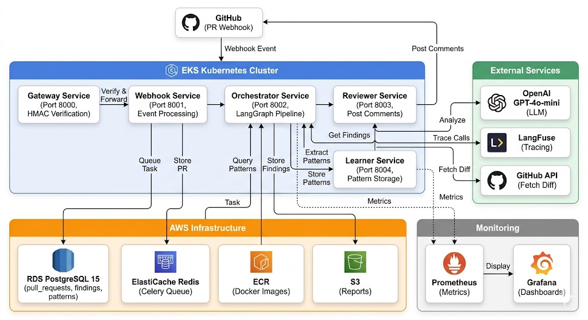

# AI Code Reviewer — Production-Grade System

An intelligent, production-ready system that automatically reviews pull requests on GitHub using AI agents. When a developer opens a PR, the system analyzes code patterns, identifies issues across multiple dimensions, and posts comprehensive inline comments directly on the PR.

---

## 📋 Table of Contents

1. [System Overview](#system-overview)
2. [High-Level Architecture](#high-level-architecture)
3. [Tech Stack](#tech-stack)
4. [Key Features](#key-features)
5. [Prerequisites](#prerequisites)
6. [Quick Start](#quick-start)
7. [Project Structure](#project-structure)
8. [Services Architecture](#services-architecture)
9. [Infrastructure & Deployment](#infrastructure--deployment)
10. [Monitoring & Observability](#monitoring--observability)
11. [Cost Estimate](#cost-estimate)
12. [Troubleshooting](#troubleshooting)

---

## System Overview

### What This System Does

When a developer opens or updates a Pull Request on any GitHub repository where your AI Code Reviewer bot is installed:

1. **GitHub Webhook Trigger** → GitHub sends a webhook event to your system
2. **Security Verification** → Gateway service validates the HMAC signature to ensure the request is genuinely from GitHub
3. **Event Processing** → Webhook service stores the PR metadata in the database and queues an analysis job
4. **Code Fetching** → Orchestrator service fetches the actual code diff from GitHub via the GitHub API
5. **Multi-Agent Analysis** → Four specialized AI agents run in parallel and analyze:
   - **Security Agent** → Identifies potential security vulnerabilities and unsafe patterns
   - **Performance Agent** → Detects performance bottlenecks and optimization opportunities
   - **Code Quality Agent** → Analyzes code complexity, style issues, and maintainability
   - **Architecture Agent** → Reviews separation of concerns, error handling, and design patterns
6. **Review Posting** → Reviewer service aggregates findings and posts them as inline comments directly on the GitHub PR
7. **Pattern Learning** → When the PR is merged, the learner service stores successful code patterns to continuously improve future reviews

---

## High-Level Architecture

### System Diagram



### System Components & Data Flow

```
Internet
    ↓
AWS Load Balancer (Public IP)
    ↓
Gateway Service (Port 8000)          ← Verifies GitHub HMAC signature
    ↓
Webhook Service (Port 8001)          ← Parses events, stores in RDS
    ↓
Celery Worker (Redis Broker)         ← Background task processing
    ↓
Orchestrator Service (Port 8002)     ← Fetches code, runs LangGraph agents
    ↓
Reviewer Service (Port 8003)         ← Posts comments to GitHub PR
    ↓
[On Merge] Learner Service (Port 8004) ← Stores patterns in PostgreSQL
```

---

## Tech Stack

### 🤖 AI & ML Backend
| Component | Purpose | Version |
|-----------|---------|---------|
| **OpenAI** | GPT-4o-mini for code analysis and reasoning | Latest |
| **LangGraph** | Orchestrates multi-agent workflows with state management | Latest |
| **LangFuse** | Traces every AI call for observability and cost tracking | Cloud |

### ⚡ Backend Framework & Async Processing
| Component | Purpose | Version |
|-----------|---------|---------|
| **FastAPI** | High-performance async web framework | 0.100+ |
| **Celery** | Distributed task queue for background processing | 5.3+ |
| **Redis (ElastiCache)** | Message broker and caching layer for Celery tasks | 7.0+ |
| **asyncio/httpx** | Async HTTP calls to GitHub API | Python 3.11+ |

### 🗄️ Database & Data Layer
| Component | Purpose | Version |
|-----------|---------|---------|
| **PostgreSQL 15 (RDS)** | Stores PRs, findings, patterns, and metrics | 15.0 |
| **SQLAlchemy** | ORM for database operations with async support | 2.0+ |
| **Alembic** | Database migration tool for schema evolution | 1.12+ |

### 🔐 Authentication & Security
| Component | Purpose | Library |
|-----------|---------|---------|
| **PyJWT** | Token generation and validation for GitHub App authentication | 2.8+ |
| **Cryptography (HMAC SHA-256)** | Validates GitHub webhook signatures | 40.0+ |
| **GitHub App OAuth** | Secure app authentication with GitHub | GitHub API v3 |

### ☁️ Infrastructure & Orchestration
| Component | Purpose | Type |
|-----------|---------|------|
| **AWS EKS** | Kubernetes cluster for service orchestration | Container Service |
| **AWS RDS** | Managed PostgreSQL database | Database Service |
| **AWS ElastiCache** | Managed Redis for Celery task queue | Cache Service |
| **AWS ECR** | Docker image registry | Container Registry |
| **AWS S3** | Report and artifact storage | Object Storage |
| **AWS Load Balancer (ALB)** | Public entry point and traffic distribution | Load Balancer |
| **Terraform** | Infrastructure-as-Code for reproducible deployments | IaC Tool |
| **Docker** | Containerization of all services | Container Runtime |

### 🔄 CI/CD Pipeline
| Component | Purpose | Integration |
|-----------|---------|-------------|
| **GitHub Actions** | Automated testing, building, and deployment | Native to GitHub |
| **kubectl** | Kubernetes cluster management | CLI Tool |

### 📊 Monitoring & Observability
| Component | Purpose | Type |
|-----------|---------|------|
| **Prometheus** | Metrics collection and time-series storage | Metrics DB |
| **Grafana** | Real-time dashboards and alerting | Visualization |
| **LangFuse Dashboard** | AI call tracing and performance analysis | Observability |
| **RAGAS** | Evaluation framework for code review quality | QA Framework |

---

## Key Features

✅ **Production-Ready Architecture**
- Load-balanced, auto-scaling services
- Horizontally scalable Kubernetes deployment
- Automatic failover and health checks
- Blue-green deployment strategy

✅ **Multi-Agent AI Analysis**
- Four specialized agents analyzing different code aspects in parallel
- Stateful workflow orchestration with LangGraph
- Intelligent pattern learning from merged PRs
- Context-aware code understanding

✅ **Deep GitHub Integration**
- Real-time PR webhook events
- Inline code comments with precise line references
- Pattern tracking across repositories
- Automatic bot installation

✅ **Enterprise Monitoring**
- Real-time metrics with Prometheus
- Beautiful dashboards with Grafana
- Complete AI call tracing with LangFuse
- Custom alerts on service health
- Cost tracking per PR analysis

✅ **Infrastructure Automation**
- One-command Terraform provisioning
- Automated CI/CD with GitHub Actions
- Zero-downtime deployments
- Reproducible infrastructure

---

## Prerequisites

### Accounts Required
- **AWS Account** (with billing configured)
- **GitHub Account** (personal or organization)
- **OpenAI Account** (with API credits, minimum $10)
- **LangFuse Account** (free, open-source option available)

### Local Tools Required
| Tool | Version | Purpose |
|------|---------|---------|
| AWS CLI | v2.0+ | AWS resource management |
| Terraform | v1.0+ | Infrastructure provisioning |
| kubectl | v1.29+ | Kubernetes cluster management |
| Git | v2.0+ | Version control |
| Helm | v3.0+ | Kubernetes package manager |
| Docker Desktop | Latest | Local container testing (optional) |

### Recommended System Specs
- 4GB RAM minimum (8GB recommended)
- 10GB free disk space
- Stable internet connection
- macOS, Linux, or Windows with WSL2

---

## Quick Start

### Phase 1: Account Setup (15 minutes)
```bash
# 1. Create AWS account at https://aws.amazon.com
# 2. Create GitHub account or use existing
# 3. Create OpenAI account with API credits
# 4. Create LangFuse account (free tier)
```

### Phase 2: Install Tools (10 minutes)
```bash
# AWS CLI
brew install awscli

# Terraform
brew install terraform

# kubectl
brew install kubectl

# Helm
brew install helm

# Verify installations
aws --version
terraform --version
kubectl version --client
helm version
```

### Phase 3: Infrastructure Provisioning (25 minutes)
```bash
cd infra/terraform

terraform init

terraform plan \
  -var="cluster_name=ai-code-reviewer" \
  -var="db_password=YourStrongPassword123!" \
  -var="environment=production"

terraform apply \
  -var="cluster_name=ai-code-reviewer" \
  -var="db_password=YourStrongPassword123!" \
  -var="environment=production"

# Save output values
terraform output > terraform-outputs.txt
```

### Phase 4: Kubernetes Configuration (5 minutes)
```bash
aws eks update-kubeconfig --name ai-code-reviewer --region us-east-1
kubectl get nodes  # Verify cluster connectivity
```

### Phase 5: Deploy Services (10 minutes)
```bash
cd infra/k8s

# Update configmap with your Redis endpoint
# Update secret.yaml with your API keys

kubectl apply -f configmap.yaml
kubectl apply -f secret.yaml
kubectl apply -f migration-job.yaml
kubectl apply -f gateway.yaml
kubectl apply -f webhook.yaml
kubectl apply -f orchestrator.yaml
kubectl apply -f reviewer.yaml
kubectl apply -f learner.yaml
kubectl apply -f webhook-worker.yaml
kubectl apply -f learner-worker.yaml
```

### Phase 6: GitHub App Setup (10 minutes)
1. Create GitHub App at https://github.com/settings/apps
2. Configure webhooks pointing to your ALB endpoint
3. Set required permissions: Contents (read), Pull Requests (read/write)
4. Subscribe to: Pull request events
5. Install app on target repositories

For detailed step-by-step instructions, see [Phase-by-Phase Setup Guide](./SETUP.md).

---

## Project Structure

```
AutomatedGithubCodeReviews/
├── services/                    # All microservices (per-service CI/CD)
│   ├── gateway/
│   │   ├── main.py             # HMAC verification, request routing
│   │   ├── models.py           # Database models
│   │   ├── requirements.txt
│   │   ├── Dockerfile
│   │   └── deploy.txt          # Deployment trigger file
│   │
│   ├── webhook/
│   │   ├── main.py             # Event parsing, database writes
│   │   ├── models.py
│   │   ├── worker.py           # Celery task consumer
│   │   ├── requirements.txt
│   │   ├── Dockerfile
│   │   └── deploy.txt
│   │
│   ├── orchestrator/
│   │   ├── main.py
│   │   ├── graph.py            # LangGraph AI agent orchestration
│   │   ├── models.py
│   │   ├── requirements.txt
│   │   ├── Dockerfile
│   │   └── deploy.txt
│   │
│   ├── reviewer/
│   │   ├── main.py             # GitHub PR comment posting
│   │   ├── models.py
│   │   ├── requirements.txt
│   │   ├── Dockerfile
│   │   └── deploy.txt
│   │
│   └── learner/
│       ├── main.py
│       ├── models.py           # Pattern storage models
│       ├── worker.py           # Celery task consumer
│       ├── requirements.txt
│       ├── Dockerfile
│       └── deploy.txt
│
├── infra/
│   ├── terraform/              # AWS infrastructure provisioning
│   │   ├── main.tf             # VPC, EKS, RDS, ElastiCache
│   │   ├── variables.tf        # Input variables
│   │   ├── outputs.tf          # Output values
│   │   └── .gitignore
│   │
│   └── k8s/                    # Kubernetes manifests
│       ├── configmap.yaml      # Environment variables
│       ├── secret.yaml         # Secrets (encrypted API keys)
│       ├── gateway.yaml        # Gateway deployment
│       ├── webhook.yaml        # Webhook deployment
│       ├── orchestrator.yaml   # Orchestrator deployment
│       ├── reviewer.yaml       # Reviewer deployment
│       ├── learner.yaml        # Learner deployment
│       ├── webhook-worker.yaml # Webhook Celery worker
│       ├── learner-worker.yaml # Learner Celery worker
│       ├── hpa.yaml           # Horizontal pod autoscaler
│       ├── ingress.yaml       # ALB ingress controller
│       ├── migration-job.yaml # Database schema migrations
│       └── kubectl            # kubectl config helper
│
├── db/
│   ├── alembic.ini            # Alembic configuration
│   └── migrations/
│       ├── env.py
│       └── versions/          # Migration scripts
│           └── 0001_initial.py
│
├── monitoring/
│   ├── prometheus.yml         # Prometheus scrape configs
│   └── grafana-dashboard.json # Pre-built dashboards
│
├── scripts/
│   ├── Dockerfile             # Evaluation job container
│   └── evaluate.py            # RAGAS evaluation framework
│
├── tech_stack.txt             # Technology summary
├── README.md                  # This file
└── .gitignore
```

---

## Services Architecture

### 1. Gateway Service (Port 8000)
**Responsibility:** HMAC verification, request validation, load balancing

```
Incoming Webhook from GitHub
         ↓
Verify HMAC-SHA256 Signature
         ↓
Extract PR metadata
         ↓
Rate limiting check
         ↓
Forward to Webhook Service
         ↓
Return 202 Accepted
```

**Tech Stack:** FastAPI, PyJWT, cryptography, httpx

---

### 2. Webhook Service (Port 8001)
**Responsibility:** Event parsing, database persistence, async task queueing

```
Verified Request
         ↓
Parse Pull Request Event
         ↓
Extract PR Details (ID, author, URL, etc)
         ↓
Store in PostgreSQL via SQLAlchemy
         ↓
Queue Celery Task to Redis
         ↓
Send 200 OK response
```

**Tech Stack:** FastAPI, SQLAlchemy, Celery, Redis, PostgreSQL

---

### 3. Orchestrator Service (Port 8002)
**Responsibility:** AI analysis orchestration, multi-agent coordination, LangGraph workflow

```
Celery Task from Queue
         ↓
Fetch PR Diff from GitHub API
         ↓
Initialize LangGraph State Machine
         ↓
      ┌──────────────────────────────────┐
      ├─→ Security Agent (parallel)
      ├─→ Performance Agent (parallel)
      ├─→ Code Quality Agent (parallel)
      └─→ Architecture Agent (parallel)
      └──────────────────────────────────┘
         ↓
Aggregate findings from all agents
         ↓
Format with markdown and code blocks
         ↓
Queue Reviewer task
```

**Tech Stack:** FastAPI, LangGraph, LangChain, OpenAI (GPT-4o-mini), LangFuse, httpx, SQLAlchemy

---

### 4. Reviewer Service (Port 8003)
**Responsibility:** GitHub PR comment posting, finding aggregation

```
Findings from Orchestrator
         ↓
Group findings by severity (critical, major, minor)
         ↓
Format as GitHub PR comments
         ↓
Post to PR via GitHub API
         ↓
Store comment references in PostgreSQL
         ↓
Update PR status
```

**Tech Stack:** FastAPI, GitHub API, SQLAlchemy, httpx

---

### 5. Learner Service (Port 8004)
**Responsibility:** Pattern extraction, model improvement, continuous learning

```
PR Merge Event
         ↓
Extract code patterns
         ↓
Analyze context and metadata
         ↓
Vectorize with OpenAI embeddings
         ↓
Store in PostgreSQL vector table
         ↓
Update learning statistics
         ↓
Generate metrics for improvement
```

**Tech Stack:** FastAPI, SQLAlchemy, OpenAI (embeddings), RAGAS, PostgreSQL

---

## Infrastructure & Deployment

### AWS Resources Created by Terraform

| Resource | Type | Config | Purpose |
|----------|------|--------|---------|
| **EKS Cluster** | Container Orchestration | 2× t3.medium nodes | Runs all 5 microservices |
| **RDS PostgreSQL 15** | Managed Database | db.t3.micro, Multi-AZ | Stores PRs, findings, patterns |
| **ElastiCache Redis** | Cache/Message Broker | cache.t3.micro | Celery task queue, caching |
| **ECR Repositories** | Container Registry | 1 per service | Stores Docker images |
| **S3 Bucket** | Object Storage | Standard tier | Reports and artifacts |
| **ALB** | Load Balancer | 2 AZs | Public entry point |
| **VPC, Subnets, SGs** | Networking | /16 CIDR | Network isolation |

### Deployment Pipeline

```
Developer pushes code to main branch
         ↓
GitHub detects changes in service folder
         ↓
GitHub Actions workflow triggered
         ↓
┌─ Per-Service Pipeline (runs in parallel) ─┐
│                                            │
│  Job 1: Test (pytest on service tests)    │
│           ↓                                │
│  Job 2: Build (docker build)              │
│           ↓                                │
│  Job 3: Push (to ECR)                     │
│           ↓                                │
│  Job 4: Deploy (kubectl set image)        │
│                                            │
└────────────────────────────────────────────┘
         ↓
Blue-green deployment on EKS
         ↓
Health checks pass (readiness probes)
         ↓
New version goes live
         ↓
Old version terminated (10 sec grace period)
```

**Zero-downtime deployment** achieved through:
- Rolling updates (maxUnavailable: 0, maxSurge: 1)
- Health checks at multiple levels (startup, readiness, liveness)
- Graceful shutdown handling (SIGTERM → close connections → exit)

---

## Monitoring & Observability

### Real-Time Metrics (Prometheus + Grafana)

**Service-Level Metrics:**
- Request latency (p50, p95, p99 percentiles)
- Error rates by status code and endpoint
- Active connections and throughput
- Task queue depth (Celery queue sizes)
- Worker utilization rates

**Infrastructure Metrics:**
- Kubernetes pod CPU and memory usage
- Node health, readiness, and capacity
- Persistent volume usage and I/O
- Network traffic in/out
- Pod restart counts

**Custom Dashboards:**
- System Overview (all services at a glance)
- Service Health (per-service metrics and logs)
- Database Performance (queries, connections, replication)
- AI Costs (per PR, per agent, trends)
- API Latency Distribution (histogram views)

**Access:** http://grafana.your-domain.com (after ingress setup)

---

### AI Call Tracing (LangFuse)

Every OpenAI API call is traced for observability:

**Tracked Metrics:**
- Full prompt and completion text
- Token usage (prompt, completion, total)
- API cost per call
- Agent execution time
- Model selection and parameters
- Error logs and retry attempts

**Dashboards:**
- Cost per PR analysis
- Model performance comparison
- Latency distributions
- Error tracking
- Usage trends

**Access:** https://cloud.langfuse.com (your project)

---

## Cost Estimate

### Monthly Breakdown (Typical Usage - ~500 PRs/month)

| Service | Usage | Est. Cost |
|---------|-------|-----------|
| **EKS** | 2 t3.medium nodes (8 hrs/day) | ~$60 |
| **RDS PostgreSQL** | db.t3.micro + storage (200GB) | ~$35 |
| **ElastiCache Redis** | cache.t3.micro (500K ops/month) | ~$20 |
| **S3** | 100GB storage + 50K requests | ~$5 |
| **Load Balancer ALB** | 1 ALB + 1M requests/month | ~$20 |
| **Data Transfer** | ~10GB/month out of AWS | ~$1 |
| **OpenAI API** | 500 PRs × ~0.0002/PR | ~$100 |
| **Miscellaneous** | VPC, CloudWatch, snapshots | ~$10 |
| | **TOTAL MONTHLY** | **~$250** |

**Cost Optimization Tips:**
- Use Reserved Instances for 30-40% savings
- Enable S3 intelligent tiering for archival
- Set up CloudWatch alarms for spending
- Use spot instances for non-critical jobs

---

## Troubleshooting

### Common Issues & Solutions

#### Issue: Pods stuck in `Pending` state
```bash
kubectl describe pod <pod-name>
kubectl logs <pod-name>

# Check node capacity
kubectl describe nodes

# Check PVC binding
kubectl get pvc
```

#### Issue: Services can't connect to Redis
```bash
# Verify ElastiCache security group allows pod CIDR
aws ec2 describe-security-groups --filters Name=group-id,Values=sg-xxxxx

# Test connectivity from pod
kubectl run -it --image=redis redis-cli -- redis-cli -h <redis-endpoint> ping

# Check configmap
kubectl get configmap app-config -o yaml
```

#### Issue: Database migrations failed
```bash
# Check migration job logs
kubectl logs job/db-migrate

# Manually connect to database
kubectl port-forward svc/postgres 5432:5432
psql -h localhost -U dbadmin -d codereviewer
```

#### Issue: GitHub webhook not received
```bash
# Check webhook delivery
# Go to GitHub repo → Settings → Webhooks → Recent deliveries

# Verify ALB is reachable
curl -v https://your-alb-endpoint/health

# Check gateway service logs
kubectl logs -f deployment/gateway
```

#### Issue: AI calls failing (OpenAI errors)
```bash
# Check secret is properly set
kubectl get secret app-secrets -o yaml | grep OPENAI

# Check LangFuse connectivity
kubectl logs -f deployment/orchestrator | grep -i langfuse

# Monitor API usage at https://platform.openai.com/account/usage
```

#### Issue: High latency or timeouts
```bash
# Check if orchestrator is auto-scaling
kubectl get hpa orchestrator

# Monitor metrics in Grafana
# Check database slow query logs
kubectl port-forward svc/postgres 5432:5432
psql -h localhost -U dbadmin -d codereviewer
SELECT * FROM pg_stat_statements ORDER BY mean_time DESC;
```

---

## Support & Additional Resources

### Documentation
- **Terraform Docs:** https://www.terraform.io/docs
- **Kubernetes Docs:** https://kubernetes.io/docs
- **FastAPI Docs:** https://fastapi.tiangolo.com
- **LangGraph Docs:** https://langchain-ai.github.io/langgraph/
- **GitHub API Docs:** https://docs.github.com/en/rest

### Community
- **GitHub Issues:** Use project's issues for bug reports
- **GitHub Discussions:** Q&A and feature discussions
- **AWS Support:** Available through your AWS account

### Monitoring & Debugging
- **CloudWatch Logs:** Log aggregation for all services
- **Prometheus Queries:** Custom metrics queries
- **kubectl Debugging:** Pod logs, describe, exec

---

## License

MIT License - See LICENSE file for details

---

## Contributing

1. Fork the repository
2. Create a feature branch for your service
3. Write tests for your changes
4. Commit with clear messages
5. Push to your branch
6. Create a Pull Request

GitHub Actions will automatically:
- Run tests on your changes
- Build Docker image
- Push to ECR
- Deploy to staging

---

## Project Roadmap

### v1.0 (Current)
- ✅ 5 microservices with independent CI/CD
- ✅ Multi-agent AI code review
- ✅ GitHub PR integration
- ✅ Kubernetes orchestration
- ✅ Terraform infrastructure

### v1.1 (Planned)
- 🔄 Webhook event filtering
- 🔄 Custom review policies
- 🔄 JIRA integration
- 🔄 Slack notifications

### v2.0 (Future)
- 📅 Distributed caching layer
- 📅 Advanced ML model fine-tuning
- 📅 Multi-LLM support
- 📅 Code duplication detection

---

**Last Updated:** May 2026  
**Maintained by:** AI Code Reviewer Team  
**Status:** Production Ready ✅
